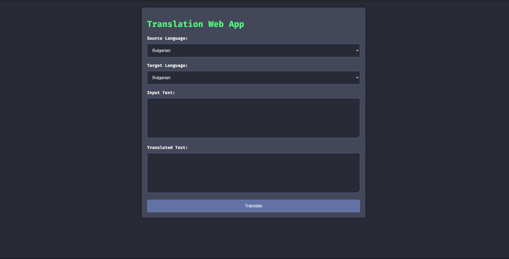

# Spring Boot Translation webapp

This is a translation  web application. The project uses Maven, spring boot, docker.



## Requirements

- JDK 22 or higher
- Docker (During the launch of the application, a working Docker engine is required)

## Getting Started

### Cloning the Repository

First, clone the repository to your local machine:

```bash
git clone https://github.com/DaryzDark/translateTwebApp.git
```
### Quick run with Docker

Use the command below and the application will most likely work. Docker will handle everything for you. You can acsess app from your browser using http://localhost:8080. 

To run the application, execute:
``` bash
docker-compose up -d
```
If this method did not work, use the methods below

### Building the Application

You can start the application using Maven Wrapper. This ensures that the correct version of Maven is used.

#### Using Maven Wrapper

To run the application, execute:
``` bash
./mvnw clean package
docker-compose up --build
```
On Windows, use:
```bash
mvnw.cmd clean package
docker-compose up --build
```
### Running the Application

Once the application is built and run, you can run acsess it from your browser using http://localhost:8080. The default port is 8080.